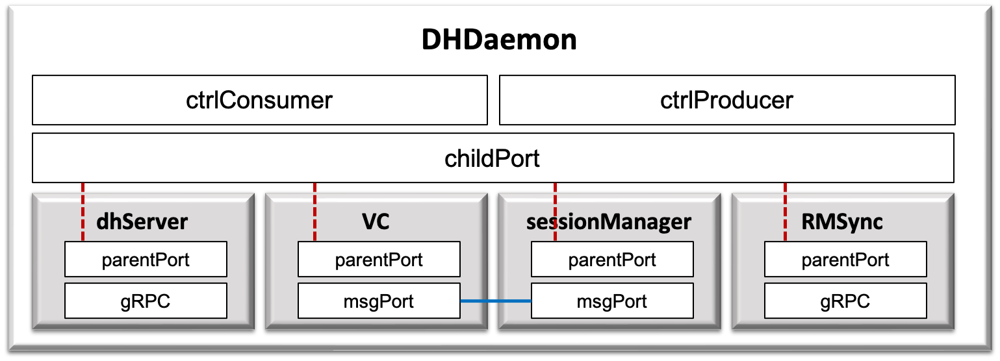

.. _dhDaemon:

DHDaemon
======================================

===============================================

:Authors:
    | Eunju Yang (yejyang@kaist.ac.kr)
    | JiHwan Kim (j.h_kim@kaist.ac.kr)
    | Jeongwon Lee (korjw1@kaist.ac.kr)
:Version: 3.0.0 of 2022.11.30

===============================================

DHDaemon 은 DIS의 데몬 모듈로, 데이터 허브와의 통신을 위한 이벤트를 처리하고 하위 모듈(`DHSearch`)로 전달하는 역할을 수행한다.

===============================================

.. js:autoclass:: DHDaemon
   :members:
   :private-members:
