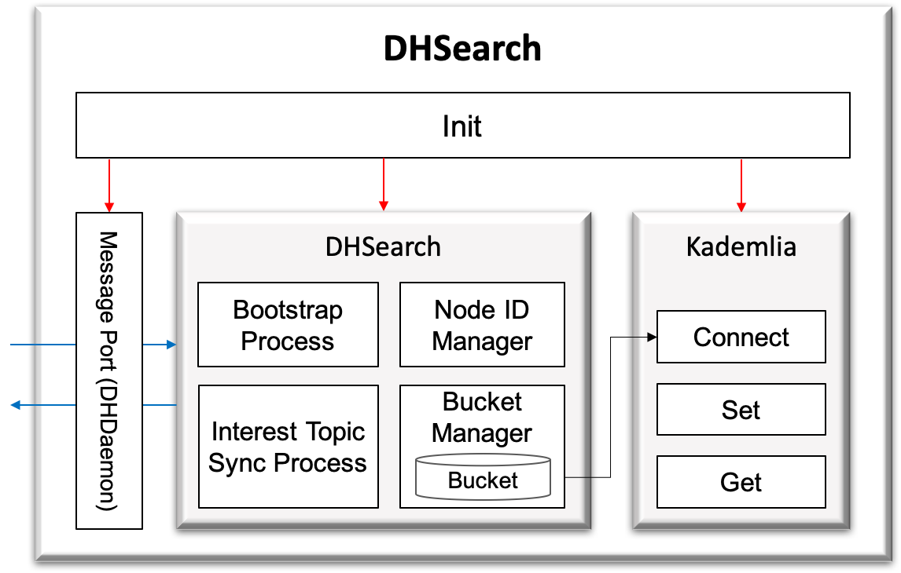

.. _dhSearch:

DHSearch
======================================

:Authors:
    | Eunju Yang (yejyang@kaist.ac.kr)
    | JiHwan Kim (j.h_kim@kaist.ac.kr)
    | Jeongwon Lee (korjw1@kaist.ac.kr)
:Version: 3.0.0 of 2022.11.30

DHSearch 는 GIS BootstrapServer 에 SeedNode 리스트를 조회하는 기능과 분산 탐색 프로토콜을 구현한 :ref:`kademlia` 라이브러리 기능을 활용하여
오픈 데이터 생태계의 데이터 허브를 탐색하면서 end point, 관심 동기화 수준, 메타데이터 정보를 수집/관리하여, :ref:`dhDaemon` 으로 전달한다.

===============================================

.. js:autoclass:: DHSearch
   :members:
   :private-members:
