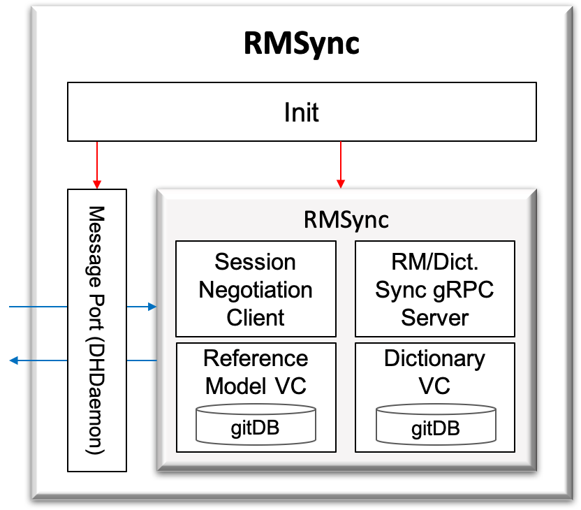

.. _rmSync:

RMSync
======================================

:Authors:
    | Eunju Yang (yejyang@kaist.ac.kr)
    | JiHwan Kim (j.h_kim@kaist.ac.kr)
    | Jeongwon Lee (korjw1@kaist.ac.kr)
:Version: 3.0.0 of 2022.11.30

RMSync 는 GIS RMSessionManager 와 오픈 참조 모델(Reference Model)과 딕셔너리(Dictionary) 동기화를 위한 세션 협상을 수행한 뒤,
GIS RMSession 과 세션 연동하고, 오픈 참조 모델과 딕셔너리 동기화 수신을 위한 gRPC 서버를 구동함으로써 추후 GIS 에서 업데이트되는 오픈 참조 모델과 딕셔너리를 동기화한다.

===============================================

.. js:autoclass:: RMSync
   :members:
   :private-members:
