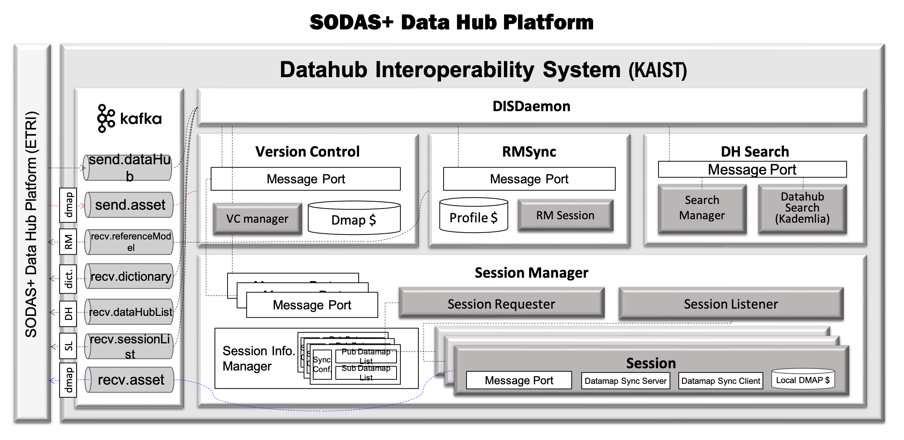

SODAS+ 데이터 허브 상호운용 시스템 (DIS)
==============================================================================


데이터 허브 상호 운용 시스템 (이하, DIS)은 SODAS+의 ``데이터맵 관리 시스템`` (혹은 SODAS+ ``데이터허브 플랫폼``)과 연동되어 동작하며,
데이터맵 관리 시스템을 통해 획득되는 관리자의 요청사항을 관리하고 결과를 반환한다.

.. image:: _static/sodas_dis.png
    :scale: 45
    :align: center
    :alt: SODAS+ DIS의 동작. SODAS+ 데이터허브 플랫폼과 연동됨


주요 기능
------------------------------------------------------------------

DIS는 다음의 세 가지 주요 기능을 제공한다:

    1. `거버넌스 시스템에서 발행하는 표준 참조 모델 동기화`_
    2. `SODAS+ 시스템 내에 있는 데이터 허브 탐색 지원`_
    3. `탐색 된 데이터 허브 중 관심 정보가 같은 데이터 허브와의 실시간 동기화 지원`_


거버넌스 시스템에서 발행하는 표준 참조 모델 동기화
`````````````````````````````````````````````````````````````````````````````````````
DIS는 SODAS+ 에 참여하는 데이터 허브가 표준 참조모델을 따를 수 있도록 거버넌스 시스템으로부터 최신 버전의 표준 참조 모델을 동기홯하는 역할을 수행한다.
거버넌스 시스템은 SODAS+에서 유통되는 데이터를 관리하는 문법 및 분류체계를 관리하며 데이터 허브는 해당 규약을 기반으로하여 SODAS+ 생태계 내의
다른 데이터 허브들과 상호 작용을 수행할 수 있다.

.. image:: _static/dis-gis.png
    :scale: 45
    :align: center

|
|

SODAS+ 시스템 내에 있는 데이터 허브 탐색 지원
`````````````````````````````````````````````````````````````````````````````````````
DIS 는 SODAS+ 생태계에 존재하는 분산 데이터 허브의 탐색을 지원한다.
SODAS+의 데이터 허브 네트워크는 중앙 서버 방식이아닌 P2P 방식으로 탐색되며,
분산 데이터허브를 탐색할 때 현재 설정된 데이터 허브의 관심 정보 (Interest)를 바탕으로
관심 정보가 동일하거나 유사한 (혹은 가까운) 데이터허브를 우선적으로 탐색하도록한다.
본 탐색 결과는 ``데이터허브 플랫폼`` 으로 반환되며, 탐색은 SODAS+네트워크에 데이터 허브가 들어올때마다
업데이트 된다. 탐색 결과를 바탕으로하여 DataHub 관리자는 자신의 DataHub와 실시간으로 데이터맵 동기화를 맺을
데이터 허브를 지정할 수 있다.

.. image:: _static/dis_search.png
    :scale: 40
    :align: center

|
|

탐색 된 데이터 허브 중 관심 정보가 같은 데이터 허브와의 실시간 동기화 지원
`````````````````````````````````````````````````````````````````````````````````````
DIS 는 관심 키워드가 일치하는 데이터 허브들과의 데이터맵 동기화를 지원한다.
데이터 허브 간에 동기화 세션이 채결되면 세션이 연결된 데이터 허브끼리는 한 쪽의 데이터 맵이 변경되는 경우
해당 데이터 맵 정보를 연결된 데이터 허브로 전송한다. 이 때, 전체 데이터 맵을 동기화하지 않고,
최근에 동기화 된 상태 정보를 바탕으로 증분 데이터만을 전송하여 동기화를 수행한다.
이 때 동기화는 채결된 세션의 관심정보 특성에 기반하여 진행되기 때문에 모든 데이터맵이 동기화되는 것이 아니라
관심 키워드에 대응되는 데이터맵 만을 선택적으로 동기화하도록 지원한다.

.. image:: _static/dis-sync.png
    :scale: 40
    :align: center

|
|

동작 개요
------------------------------------------------------------------
위의 세 가지 기능을 지원하기 위하여 DIS의 시간에 따른 동작은 다음과 같다.


데이터 맵 관리 시스템 연동 구조
------------------------------------------------------------------

데이터 허브 상호운용 시스템 (DIS) 정적 구조
------------------------------------------------------------------



