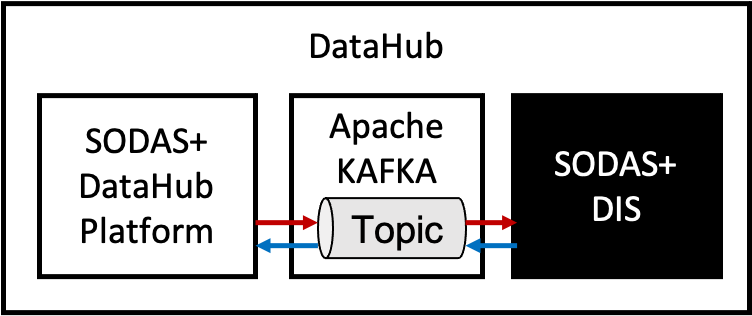
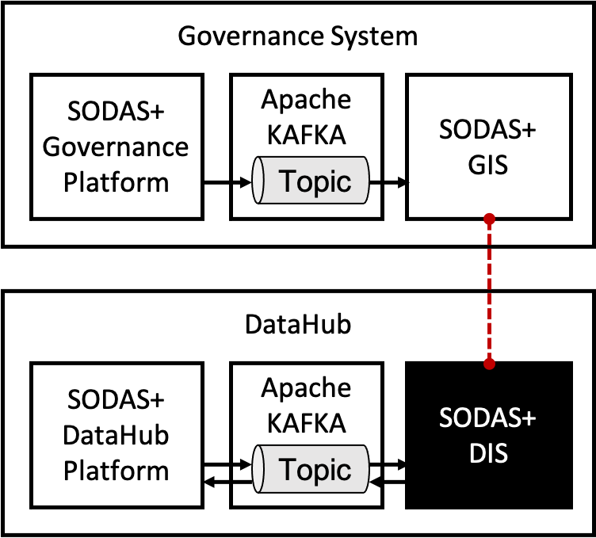
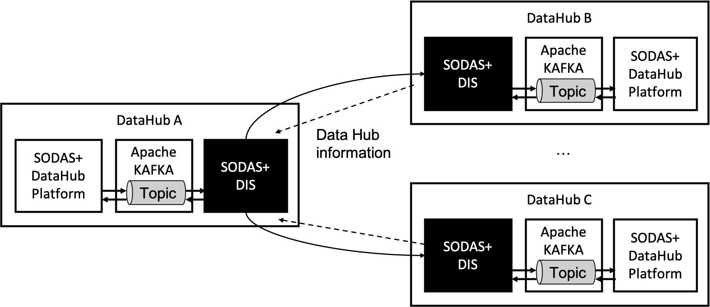
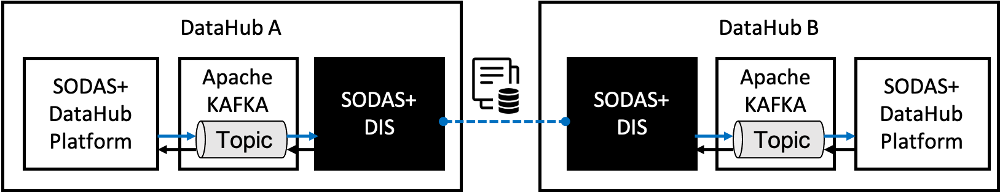
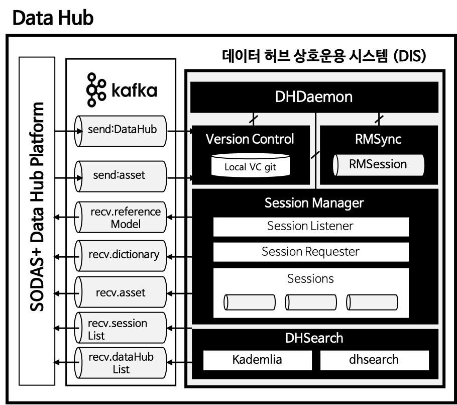
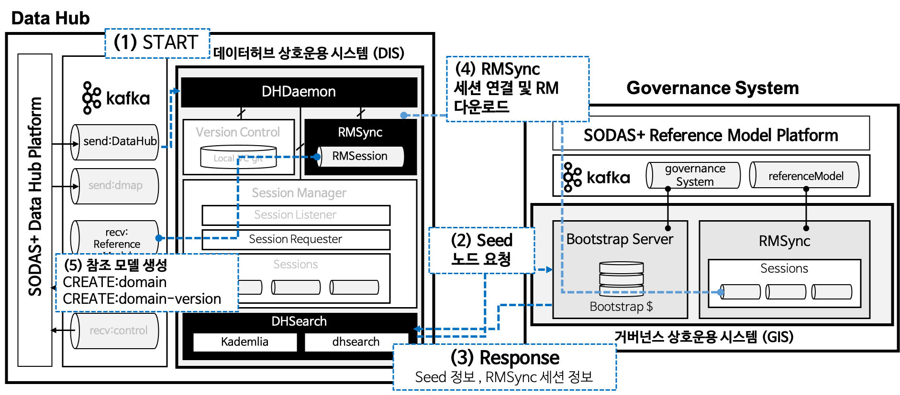
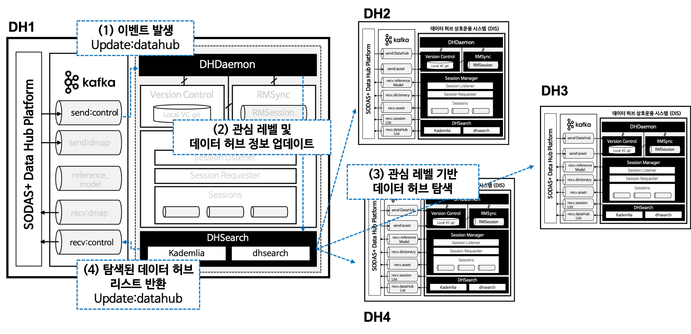
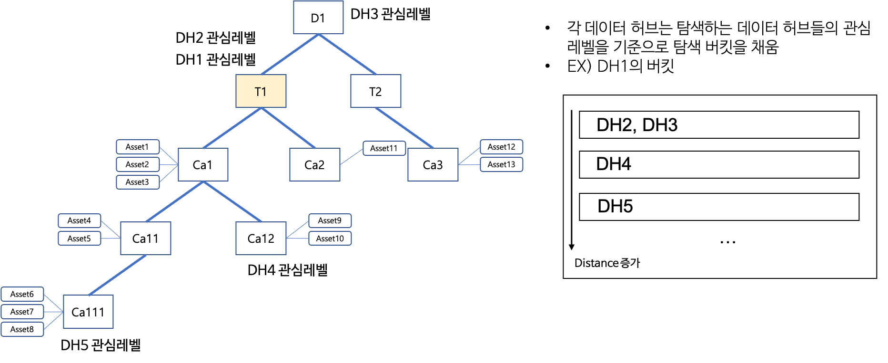
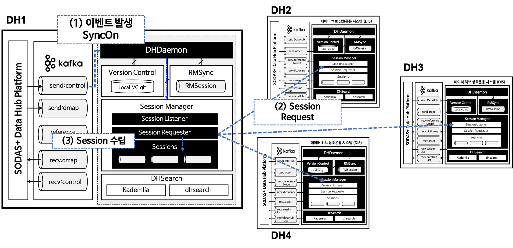
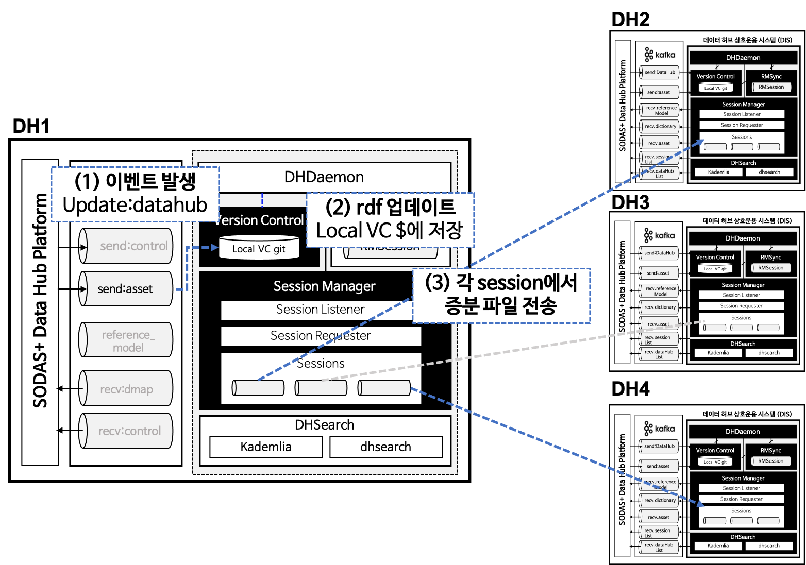

SODAS+ 데이터 허브 상호운용 시스템 (DIS)
==============================================================================


데이터 허브 상호 운용 시스템 (이하, DIS)은 SODAS+의 ``데이터맵 관리 시스템`` (혹은 SODAS+ ``데이터허브 플랫폼``)과 연동되어 동작하며,
데이터맵 관리 시스템을 통해 획득되는 관리자의 요청사항을 관리하고 결과를 반환한다.




주요 기능
------------------------------------------------------------------

DIS는 다음의 세 가지 주요 기능을 제공한다:

    1. `거버넌스 시스템에서 발행하는 표준 참조 모델 동기화`_
    2. `SODAS+ 시스템 내에 있는 데이터 허브 탐색 지원`_
    3. `탐색 된 데이터 허브 중 관심 정보가 같은 데이터 허브와의 실시간 동기화 지원`_


거버넌스 시스템에서 발행하는 표준 참조 모델 동기화
`````````````````````````````````````````````````````````````````````````````````````
DIS는 SODAS+ 에 참여하는 데이터 허브가 표준 참조모델을 따를 수 있도록 거버넌스 시스템으로부터 최신 버전의 표준 참조 모델을 동기홯하는 역할을 수행한다.
거버넌스 시스템은 SODAS+에서 유통되는 데이터를 관리하는 문법 및 분류체계를 관리하며 데이터 허브는 해당 규약을 기반으로하여 SODAS+ 생태계 내의
다른 데이터 허브들과 상호 작용을 수행할 수 있다.



|

거버넌스 시스템과의 오픈 참조 모델 동기화는 두 가지 상황에서 발생한다:

    1. 데이터 허브가 처음 SODAS+ 플랫폼에 참여한 경우
    2. 표준 허브 내에서 참조 모델의 업데이트가 발생한 경우.


첫 번째 경우 DIS로 `START` 이벤트가 들어오면 :ref:`RMSyncModule` 는 거버넌스 시스템에 해당 데이터 허브의 SODAS+ 플랫폼 참여를 알린다.
GIS는 해당 데이터 허브와의 참조 모델 동기화 세션을 맺으며 현재 거버넌스 시스템 내에 있는 모든 참조 모델을 데이터 허브로 전송한다.
DIS의 참조 모델 동기화 세션은 거버넌스 시스템으로부터 전달받은 참조 모델을 ``데이터맵 관리 시스템`` 으로 전송한다.


두 번째 경우는 DIS가 GIS와 참조 모델 동기화 세션을 맺고있을 때 발생하며 GIS 내에 탐조 모델 업데이트 혹은 새로운 참조 모델 생성이 감지되는 경우
이를 DIS로 전송한다.
이 때, DIS로 전달되는 모든 참조 모델은 DIS 내의 버전 관리 모듈 (:ref:`VersionControlModule`)로 전달됨과 동시에 ``데이터맵 관리 시스템`` 으로 전달된다.


SODAS+ 시스템 내에 있는 데이터 허브 탐색 지원
`````````````````````````````````````````````````````````````````````````````````````
DIS 는 SODAS+ 생태계에 존재하는 분산 데이터 허브의 탐색을 지원한다.
SODAS+의 데이터 허브 네트워크는 중앙 서버 방식이아닌 P2P 방식으로 탐색되며,
분산 데이터허브를 탐색할 때 현재 설정된 데이터 허브의 관심 정보 (Interest)를 바탕으로
관심 정보가 동일하거나 유사한 (혹은 가까운) 데이터허브를 우선적으로 탐색하도록한다.
본 탐색 결과는 ``데이터허브 플랫폼`` 으로 반환되며, 탐색은 SODAS+네트워크에 데이터 허브가 들어올때마다
업데이트 된다. 탐색 결과를 바탕으로하여 DataHub 관리자는 자신의 DataHub와 실시간으로 데이터맵 동기화를 맺을
데이터 허브를 지정할 수 있다.



|
|

탐색 된 데이터 허브 중 관심 정보가 같은 데이터 허브와의 실시간 동기화 지원
`````````````````````````````````````````````````````````````````````````````````````
DIS 는 관심 키워드가 일치하는 데이터 허브들과의 데이터맵 동기화를 지원한다.
데이터 허브 간에 동기화 세션이 채결되면 세션이 연결된 데이터 허브끼리는 한 쪽의 데이터 맵이 변경되는 경우
해당 데이터 맵 정보를 연결된 데이터 허브로 전송한다. 이 때, 전체 데이터 맵을 동기화하지 않고,
최근에 동기화 된 상태 정보를 바탕으로 증분 데이터만을 전송하여 동기화를 수행한다.
이 때 동기화는 채결된 세션의 관심정보 특성에 기반하여 진행되기 때문에 모든 데이터맵이 동기화되는 것이 아니라
관심 키워드에 대응되는 데이터맵 만을 선택적으로 동기화하도록 지원한다.



|
|

데이터 허브 상호운용 시스템 (DIS) 정적 구조
------------------------------------------------------------------
데이터 허브 상호 운용 시스템의 정적 구조는 아래 그림과  같다.
데이터 허브 상호 운용 시스템은 데몬 (:ref:`DaemonModule`) , 데이터 허브 분산 탐색 모듈 (:ref:`DHSearchModule`),
참조 모델 동기화 모듈 (:ref:`RMSyncModule`), 데이터맵 동기화 모듈 (:ref:`SessionManagerModule`),
데이터맵 버전 관리 모듈 (:ref:`VersionControlModule`)로 구성된다.




|

.. list-table:: 데이터 허브 상호 운용 시스템 (DIS) 모듈 개요
   :widths: 15 15 70
   :header-rows: 1
   :align: center

   * - Module
     - Sub-Modules
     - Description

   * - :ref:`DaemonModule`
     - | :ref:`dhDaemon`
       | :ref:`ctrlKafka`
     - 데이터 허브 상호운용 시스템이 실행될 때 자동으로 백그라운드에서 실행되어 DHSearch, RMSync, SessionManager 스레드를 실행하는 최상위 스레드에 해당하는 데몬으로, SODAS+ 플랫폼에서 내부적으로 연동되는 ETRI 시스템과의 KAFKA를 통한 데이터 허브 Configuration, 동기화 옵션 등을 주고받아, 하위 스레드로 전달하는 기능을 수행

   * - :ref:`DHSearchModule`
     - | :ref:`dhSearch`
       | :ref:`kademlia`
     - 데이터 허브 상호운용 시스템 데몬에 의해 실행되는 스레드로, 실행 초기에는 참조 허브(RH)의 Bootstrap 서버로부터 SODAS+ 플랫폼에 최근 접속한 Seed Node의 접속 정보와 시스템 데몬으로부터 사용자 관심 토픽 레벨 정보를 받아, 관심 토픽의 데이터맵을 소유한 다른 데이터 허브를 분산 탐색하는 기능을 수행

   * - :ref:`RMSyncModule`
     - | :ref:`rmSync`
     - 데이터 허브 상호운용 시스템 데몬에 의해 실행되는 스레드로, 실행 초기에는 참조 허브(RH)와 세션 연동을 통한 참조 모델(Reference-Model)를 수신 받아 관리(표준 허브와 동기화)하며, 추후 참조 허브(RH)에서 참조 모델이 업데이트될 경우, 동기화하는 기능을 수행

   * - :ref:`SessionManagerModule`
     - | :ref:`sessionManager`
       | :ref:`session`
     - 데이터 허브 상호운용 시스템 데몬에 의해 실행되는 스레드로, 시스템 데몬으로부터 동기화 옵션을 전달받아 관리하며, DHSearch 모듈에서 탐색한 관심 토픽의 데이터맵을 소유한 다른 데이터 허브와의 데이터맵 동기화를 위한 세션 연동 기능을 수행하며, VersionControl 모듈과 연동하여 다른 데이터 허브와의 세션을 통한 데이터맵 전송 기능을 수행

   * - :ref:`VersionControl`
     - | :ref:`VCModule`
     - | :ref:`VCConsumer`
     - | :ref:`VersionController`
     - 데이터 허브 시스템에서 발생한 데이터맵 변화 이벤트에 따른 증분 데이터 기반 데이터맵 버전 관리 기능을 수행


|

동작 개요
------------------------------------------------------------------
위의 세 가지 기능을 지원하기 위하여 DIS의 시간에 따른 동작은 다음과 같다.

    1. `데이터 허브 시작`_
    2. `관심 정보 업데이트`_
    3. `데이터맵 동기화`_


데이터 허브 시작
`````````````````````````````````````````````````````````````````````````````````````
데이터 허브가 시작하면 `데이터 허브 플랫폼`은 `START` 이벤트를 발생하고, DIS는 `START` 이벤트를 감지하여
GIS와의 통신을 시작한다. GIS와의 통신을 통해 현재 SODAS+ 플랫폼 내의 분산 데이터 허브 탐색을 위한
시드 노드 정보를 받아오고 이와 동시에 현재 `거버넌스 시스템`에서 관리중인 표준 참조 모델을 가져와서
`데이터허브 플랫폼`으로 전달한다.



|

관심 정보 업데이트
`````````````````````````````````````````````````````````````````````````````````````
관심 정보 업데이트는 ETRI에서 개발한 SODAS+ Portal 웹페이지에서 발생된다. 이는 사용자에 의해 결정되거나 혹은 데이터 허브가 보유한 데이터 셋의 속성에 의해 결정된다.
데이터 허브의 관심 정보 (혹은 관심 레벨)는 SODAS+ 시스템 내에서 데이터 허브가 위치할 오버레이 네트워크를 결정한다.
다시 말해, 데이터 허브 탐색 시 타 데이터 허브와의 거리를 측정하기 위한 기준이 된다.
설정된 관심 정보를 바탕으로 데이터 허브의 고유 값이 수정되며, 이를 바탕으로 SODAS+ 네트워크를 재 탐색하여 거리 기반의 데이터 허브 버켓을 채운다.
관심 정보 업데이트 이벤트 (`UPDATE`) 가 발생한 경우 상호 운용 시스템의 동작은 다음 그림과 같다.




|



|

데이터맵 동기화
`````````````````````````````````````````````````````````````````````````````````````
데이터 맵 동기화는 관심 레벨 설정이 수행된 이후 수행되어야 하며, 데이터맵 동기화는 사용자 포탈 혹은 CLI 명령어를 통해 트리거된다.
SyncON 이벤트가 분산 동기화 시스템으로 전달되면 데이터 허브는 기존에 탐색 단계에서 가지고 있는 데이터 허브 버킷을 가까운 거리 순으로 순회하며 세션을 맺는다.
아래 그림은 ``SYNC_ON`` 이벤트를 감지하고 세션을 요청하는 프로세스를 보여준다.




|

세션이 연결된 이후에는 각 세션은 세션에서 협의된 내용을 바탕으로 파일 전송이 이루어진다.
다음 그림는 데이터맵 수정/생성/삭제 이벤트가 전달되었을 때 대응되는 세션에서의 능동적 동기화 시나리오를 보여준다.



|

데이터 맵 관리 시스템과의 연동 구조
------------------------------------------------------------------
DIS는 ``데이터맵 관리 시스템`` 과 연동되어 작동하며, 시스템으로부터 들어오는 이벤트에 따라 동작을 수행한다.
다음은 ``데이터맵 관리 시스템`` 과 DIS 간 통신을 위해 정의된 이벤트 종류를 보여준다.

.. list-table:: 데이터 허브 상호 운용 시스템 (DIS) 및 데이터맵 관리 시스템 연동 기능에 따른 이벤트
   :widths: 20 20 20 20 20
   :header-rows: 1
   :align: center

   * - 구분
     - 토픽
     - TX
     - RX
     - Operation
   * - 데이터 허브 제어
     - send.dataHub
     - DHPlatform
     - DIS
     - | START
       | UPDATE
       | SYNC_ON
   * - 데이터 허브 에셋 동기화 관리
     - send.asset
     - DHPlatform
     - DIS
     - | CREATE
       | UPDATE
   * - 데이터 허브 에셋 동기화 관리
     - recv.asset
     - DIS
     - DHPlatform
     - | CREATE
       | UPDATE
   * - 데이터 허브 탐색
     - recv.dataHubList
     - DIS
     - DHPlatform
     - UPDATE
   * - 참조 모델 관리
     - recv.referenceModel
     - DIS
     - DHPlatform
     - | CREATE
       | UPDATE
   * - 딕셔너리 관리
     - recv.dictionary
     - DIS
     - DHPlatform
     - | CREATE
       | UPDATE
   * - 세션 정보 관리
     - recv.sessionList
     - DIS
     - DHPlatform
     - UPDATE
