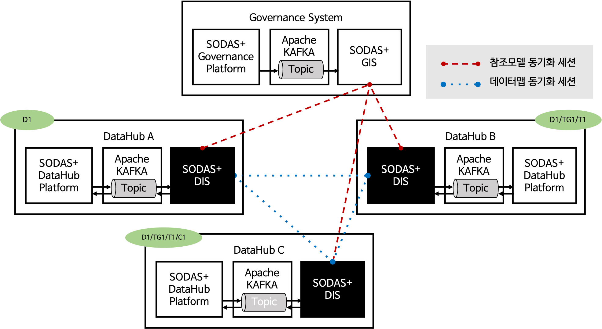

SODAS+ 오픈 데이터 생태계 개요
==============================================================================

SODAS+ 는 오픈 데이터 생태계 구축 플랫폼으로, 생태계에 참여하여 데이터 공유를 지원하는 ``데이터 허브 (DataHub)`` 와
생태계의 관리 감독을 담당하는 ``거버넌스 시스템 (Governance System)`` 으로 구성된다. ``데이터 허브`` 는 데이터 셋을 관리, 유통하는 주체로서
SODAS+ 에 참여하여 오픈 데이터 생태계를 형성한다.
이 때, SODAS+의 데이터 생태계는 ``거버넌스 시스템`` 에 의해 정의된 참조 모델을 따르며, 생태계에 참여하는 데이터 허브들은 ``거버넌스 시스템`` 에서 지원되는 문법을 따라야 한다.

본 문서에서 다루는 ``거버넌스 상호운용 시스템 (GIS)`` 은 거버넌스 시스템에서 관리하는 오픈 데이터 생태계 환경에서 데이터맵의 문법 체계를 정의한
Reference Model 과 Vocabulary 버전를 관리하며, 버전이 변경된 시점마다 데이터 허브로의 동기화를 지원한다.





|
|

SODAS+ 거버넌스 시스템과 거버넌스 상호운용 시스템
_________________________________________________________________________________________________________

SODAS+ 거버넌스 시스템은 독립적인 다수의 데이터 허브들이 보유한 데이터 셋의 공유를 위해 기술된 데이터맵의 문법과 정책을 정의한 **표준 참조 모델** 을 관리한다.

표준 참조 모델 (Reference Model 또는, RM)은 SODAS+에서 공유되는 데이터 셋의 종류를 체계적으로 나누기 위한 모델로,
각 카테고리의 데이터 셋을 표현하는 문법을 관장하기 위한 프로파일 문법과 연동된다.
표준 참조 모델은 ``거버넌스 시스템`` 에 의해 관리되며 SODAS+에 참여하는 모든 데이터허브는 최초의 참여 시 ``거버넌스 상호운용 시스템`` 에 질의를 통해 표준 참조 모델을 획득한 후
데이터 허브가 보유하고 있는 데이터 셋을 기반으로 SODAS+ 플랫폼 내 동기화 레벨을 설정한다.

이를 위하여 **거버넌스 상호 운용 시스템 (GIS)** 에서는 1) 표준 참조 모델 버전 관리와 2) 데이터 허브로의 표준 참조 모델 동기화 기능을 제공한다.


|
|

용어 정의
_________________________________________________________________________________________________________


데이터 허브 (DataHub)
`````````````````````````````````````````````````````````````````````````````````
사용자에게 데이터를 제공하는 개체로 SODAS+ 플랫폼에 참여하여 보유한 발행 데이터를 공유하거나
SODAS+ 내에 존재하는 데이터를 구독하여 사용자들에게 데이터 정보를 제공한다.

거버넌스 시스템 (Governance System)
`````````````````````````````````````````````````````````````````````````````````
SODAS+ 플랫폼에서 공유되는 데이터의 문법 및 분류체계를 관리 감독하는 시스템

데이터맵 관리 시스템, 또는 데이터 허브 플랫폼 (DataHub Platform)
`````````````````````````````````````````````````````````````````````````````````
주어진 문법 및 오픈 참조 모델을 기반으로 데이터 맵을 생성하고 데이터 허브 사용자들의 요청을 받아들이는 플랫폼

데이터허브 상호운용 시스템 (DataHub Interoperability System)
`````````````````````````````````````````````````````````````````````````````````
데이터맵 관리 시스템으로부터 전달된 요청을 처리하기위한 타 데이터허브 및 거버넌스 시스템과의 상호운용을 수행하는 개체로
본 문서에서 기술하는 핵심 시스템.
